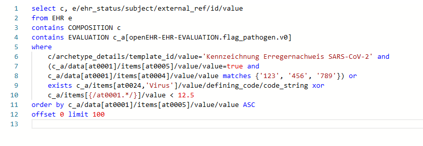

# AQL Monaco Syntax Highlighter

Just a playground project I made. Instead of using Monarch, it uses 
`monaco.languages.setTokensProvider()` and some mapping between the ANTLR 
token names and the monaco default token names to highlight the syntax.

This project provides highlighting for the Archetype Query Language (AQL)
from openEHR and uses the ANTLR file which is used by [EHRBase](https://github.com/ehrbase/ehrbase).

